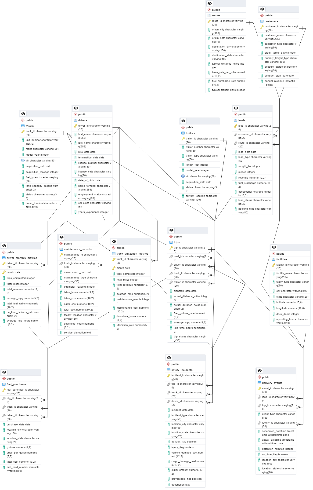
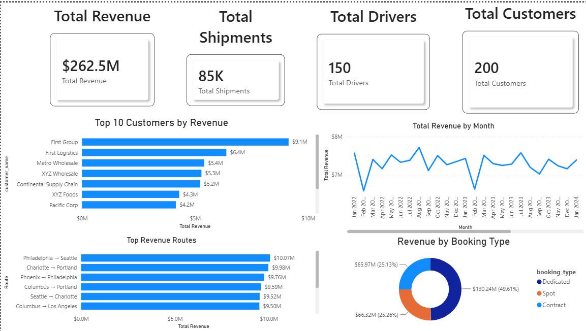

# logistics-network-performance-analysis-sql
End-to-end SQL analytics project using PostgreSQL to analyze logistics operations, customer performance, fleet efficiency, and business KPIs.

## Project Overview

This project analyzes logistics operations data using **PostgreSQL** to uncover business insights related to customer performance, transportation routes, fleet operations, and shipment bookings.

The project demonstrates SQL skills commonly used by **Logistics Analysts, Supply Chain Analysts, Operations Analysts, and Business Analysts** by solving real-world business problems through data analysis.

---

## Business Problem

Logistics companies generate large volumes of operational data every day. However, raw transactional data alone provides limited business value.

The objective of this project is to transform operational data into actionable insights that help answer questions such as:

- Which customers contribute the most revenue?
- Which transportation routes are the most profitable?
- How efficiently are drivers performing?
- Which booking types generate the highest revenue?
- How can customers be segmented based on revenue contribution?

---

## Dataset

**Source:** Kaggle – Logistics Operations Database

The dataset contains information on:

- Customers
- Drivers
- Trucks
- Trailers
- Routes
- Loads
- Trips
- Fuel Purchases
- Delivery Events
- Maintenance Records
- Safety Incidents

The data simulates real-world logistics operations and supports business analytics using SQL.

---

## Database Schema



## Tools & Technologies

- PostgreSQL
- pgAdmin 4
- SQL
- GitHub

---

## SQL Skills Demonstrated

### Database Design
- Primary Keys
- Foreign Keys
- Relational Database Design

### SQL Fundamentals
- SELECT
- WHERE
- GROUP BY
- ORDER BY
- HAVING
- Aggregate Functions
- INNER JOIN

### Intermediate SQL
- CASE Statements
- Common Table Expressions (CTEs)
- Subqueries

### Advanced SQL
- Window Functions
- RANK()
- SUM() OVER()
- Conditional Aggregation (Pivot Reports)

---

# Business KPIs

### 1. Customer Revenue Contribution

Calculated each customer's contribution to total company revenue.

---

### 2. Route Profitability

Analyzed transportation routes using Revenue per Mile.

---

### 3. Driver Performance Scorecard

Measured driver productivity using total trips, miles driven, revenue generated, and fuel efficiency.

---

# Advanced SQL Analysis

### Customer Revenue Ranking
Used **CTEs** and **Window Functions (RANK())** to rank customers based on total revenue.

### Customer Segmentation
Applied **CASE** statements to classify customers into Gold, Silver, and Bronze categories.

### Running Total Analysis
Used **SUM() OVER()** to calculate cumulative customer revenue.

### Pivot Report
Created a pivot-style report using **Conditional Aggregation** to compare shipment volume and revenue across booking types.

---

# Key Business Insights

- High-value customers contribute a significant share of total company revenue.
- Revenue per mile varies across transportation routes, highlighting opportunities for route optimization.
- Driver performance metrics help identify top-performing drivers and operational improvement opportunities.
- Dedicated booking types generated the highest shipment volume and revenue.
- Customer segmentation supports targeted relationship management strategies.

---

# Repository Structure

```
logistics-network-performance-analysis-sql
│
├── dataset
├── documentation
├── images
├── sql
└── README.md
```

---

# PowerBI Dashboard



---

# Author

**Meet Shah**
